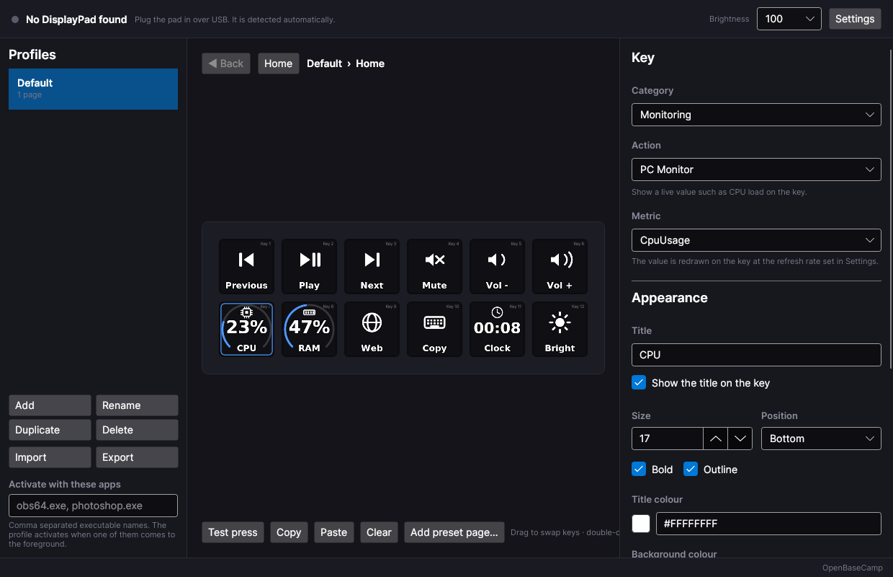
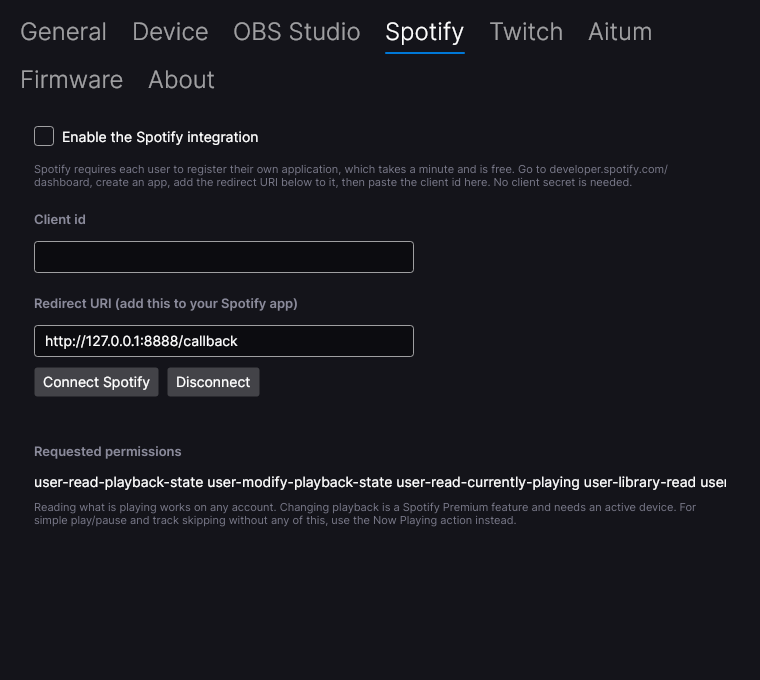

# OpenBaseCamp

An open source desktop app for the **Mountain DisplayPad**, built on the DisplayPad SDK that
Mountain published. It exists because the official **Mountain Base Camp** software is being
retired, and the pad should keep working afterwards.

OpenBaseCamp drives the pad in software mode: it renders every one of the twelve 102×102 key
faces itself, uploads them over USB, listens for key presses and runs the bound action. That
is what makes folders, live PC monitoring and third-party integrations possible — the same
model Base Camp used.

The pad is a landscape strip of **6 columns × 2 rows**. The SDK confirms it: `SetPanelImage`
defaults to `right = 799, bottom = 239`, so the panel is 800×240, and 6×2 is the only
arrangement of twelve keys whose cells (133×120) can hold a 102×102 key image.



---

## What it does

**Key bindings** — the same categories Base Camp offered:

| Category | Actions |
| --- | --- |
| General | Nothing, Multi Action (ordered list of any other actions), Delay |
| Input | Hotkey (Ctrl/Shift/Alt/Win + any key), Text, Macro, Mouse, Multimedia, Volume |
| Launch | Program (with arguments, working directory, run-as-admin), File, Folder, Website |
| System | Shut down, restart, sleep, hibernate, lock, log off, turn off displays, empty recycle bin, Task Manager |
| Navigation | Folder (nested pages), Back, Home, Switch/Next/Previous profile |
| Device | Brightness set/step/cycle, sleep the key displays |
| Monitoring | CPU, RAM (% or GB), GPU, disk, network up/down, clock, date, master volume |
| Media | **Now Playing** — play/pause, next, previous, stop and a live track readout with album art, for whatever Windows is playing |
| Media | **Spotify** — play/pause, skip, shuffle, repeat, volume, save to Liked Songs, start a playlist, now playing with cover art |
| OBS Studio | Scenes, stream, record, pause, replay buffer, source visibility, input mute, filters, transitions, virtual cam, studio mode, browser refresh, scene collections |
| Twitch | Create clip, stream marker, ad break, set title, set category, chat message, announcement, shoutout, emote/subscriber/follower/slow mode toggles, live viewer count |
| Aitum | Trigger an Aitum Desktop rule, show an Aitum state variable on a key |

**Preset pages** — one click adds a ready-made page: Photoshop, Premiere Pro, Illustrator,
DaVinci Resolve, Discord, OBS, a streaming deck and a media deck. For the creative apps,
Base Camp's "integrations" were curated shortcut sets, which is exactly what these are; the
OBS, Twitch and media packs use the real integrations.

**Profiles and pages** — unlimited profiles, each with a tree of pages. A Folder key opens a
sub-page (new pages come with a Back key already placed). Profiles can activate automatically
when a given application comes to the foreground, e.g. `obs64.exe`.

**Key appearance** — a bundled set of 53 vector icons drawn at render time, or your own
image (PNG/JPG/BMP/GIF/WebP) with contain/cover/stretch/center fitting and a scale slider.
Titles support size, colour, bold, outline and top/middle/bottom placement. Background and
icon colours are free-form. What the editor shows is exactly what the LCD gets.

**Live keys** — monitoring keys redraw on a timer with a value and a ring gauge. OBS keys
highlight themselves when their scene is live, the stream is up or an input is muted.

**Macros** — a recorder that captures the keys you press, plus manual delay, text and click
steps, with four play modes: once, repeat *n* times, toggle, and hold-to-repeat. A macro that
is cancelled mid-run always releases the keys it was holding.

**Device management** — automatic detection on plug/unplug, brightness (the firmware's
0/25/50/75/100 steps), display sleep timer, image slot usage, reset key images, factory
reset, firmware update, and writing the current page into the pad's own flash so it still
shows something when the app is not running.

**Desktop behaviour** — notification-area icon, start with Windows, start minimised,
minimise/close to tray, drag a key onto another to swap them, double-click to test, copy and
paste keys, import/export profiles as JSON.

---

## Requirements

- Windows 10 1809 or later, or Windows 11, **x64** (the SDK's native `DisplayPadSDK.dll` is
  x64 only; the Now Playing integration uses the Windows media-session API)
- [.NET 8 SDK](https://dotnet.microsoft.com/download/dotnet/8.0) to build; the .NET 8 Desktop
  Runtime to run a framework-dependent build
- A Mountain DisplayPad

## Build and run

```powershell
git clone https://github.com/azeddev/aitum.displaypad.integ
cd aitum.displaypad.integ
dotnet run --project src/OpenBaseCamp.App -f net8.0-windows10.0.19041.0
```

To produce something you can copy elsewhere:

```powershell
dotnet publish src/OpenBaseCamp.App -f net8.0-windows10.0.19041.0 -c Release -r win-x64 --self-contained false -o publish
```

`publish\OpenBaseCamp.exe` is the app. `DisplayPadSDK.dll` is copied next to it by the SDK
package and must stay there.

Run the tests with:

```powershell
dotnet test
```

## First run

1. Plug the pad in. The header turns green and the twelve keys fill with the starter layout.
2. Open **Settings → Device → Key mapping** and run the wizard once.

   Mountain never published the DisplayPad's key matrix table, so the app cannot know which
   raw code belongs to which key. It ships with a heuristic that covers the obvious encodings,
   but the wizard removes the guesswork: press each key in turn and the mapping is stored in
   your config. If presses land on the wrong key, this is the fix.
3. If the keys do nothing at all, try **Settings → Device → Firmware key handling → Leave
   unchanged**. By default the app tells the firmware to stop running its own stored bindings
   so a press produces exactly one action; not every firmware revision behaves the same way.



## Integrations

**OBS Studio** — Settings → OBS Studio. In OBS, open *Tools → WebSocket Server Settings*,
enable the server, then copy the port (4455 by default) and password across. OpenBaseCamp
speaks obs-websocket v5 directly, with no extra plugin.

**Now Playing** — nothing to configure. It talks to the Windows media session, so the same
keys control Spotify, a YouTube tab, VLC or anything else that registers transport controls,
and the now-playing key shows the track with its album art. Use this if all you want is
play/pause and skip.

**Spotify** — Settings → Spotify. Spotify requires every user to register their own
application, which is free and takes a minute: go to
[developer.spotify.com/dashboard](https://developer.spotify.com/dashboard), create an app,
add `http://127.0.0.1:8888/callback` as a redirect URI, then paste the client id into
OpenBaseCamp and press Connect. Authorisation uses PKCE so **no client secret is stored**.
Reading what is playing works on any account; changing playback is a Premium feature and
needs an active Spotify device.

**Twitch** — Settings → Twitch. Register an app at
[dev.twitch.tv/console/apps](https://dev.twitch.tv/console/apps) with
`http://localhost:3000/callback` as the OAuth redirect URL, then paste the client id and
secret in and press Connect. Twitch does not support PKCE, so the secret is what lets the
connection outlive the four-hour access token.

**Aitum Desktop** — Settings → Aitum. Aitum's public API listens on `http://localhost:7777`
with no authentication, so keep it on the local machine. Once enabled, the inspector can list
your rules by name and bind one to a key, and state variables can be shown on a key face.

## Where things are stored

`%APPDATA%\OpenBaseCamp\`

- `config.json` — profiles, pages, key bindings and settings, enums written as names so the
  file stays readable and hand-editable
- `images\` — imported key images

Saving is atomic; an unreadable config is copied to `config.json.broken` rather than
overwritten.

**A note on credentials.** The OBS password and the Spotify/Twitch OAuth tokens are stored in
`config.json` as plain text, protected only by the file's user-scoped location. That is enough
to keep them away from other user accounts on the machine, but anything running as you can
read them. Do not share the file, and use Disconnect in Settings to revoke a stored token.

## Repository layout

```
src/OpenBaseCamp.Core     Platform-neutral: model, config, rendering, actions, integrations
src/OpenBaseCamp.App      Avalonia UI, Win32 services, DisplayPad SDK wrapper
tests/                    116 tests over the core: rendering, actions, config, OAuth, presets
tools/OpenBaseCamp.UiPreview  Renders the windows to PNG headlessly for UI review
DisplayPad.SDK.Demo/      Mountain's original SDK sample, kept for reference
Macro.docx                Mountain's macro and key-table reference
```

`OpenBaseCamp.App` multi-targets `net8.0-windows10.0.19041.0` and `net8.0`.
**`net8.0-windows10.0.19041.0` is the shipping target** — the plain `net8.0` build drops the
SDK, the Win32 services and the WinRT media APIs so the UI can be compiled and screenshotted
on a machine without a pad, which is how the preview tool and CI check the interface.

## How it drives the pad

`DisplayPadHelper` from the SDK has two behaviours worth knowing about, both handled in
`src/OpenBaseCamp.App/Device/DisplayPadService.cs`:

- Constructing it already starts the SDK's own message pump and opens the USB driver, and it
  raises its static callbacks without a null check — so the app subscribes *before* creating
  the first instance.
- That pump runs on a foreground thread the SDK cannot stop on .NET 8 (`Thread.Abort` throws),
  so a normal return from `Main` would hang. Shutdown goes through
  `IPadHardware.Shutdown()`, which closes the driver and exits the process.

Key faces are rendered with SkiaSharp, hashed, and only uploaded when the image actually
changed, so a clock key does not re-push eleven unchanged neighbours every second.

## Known limitations

- **Key matrix mapping** is learned, not known — run the wizard once (see First run).
- **Firmware updates** are wired to the SDK's updater but have not been exercised against a
  real `.bin`. Only use a file Mountain supplied for the DisplayPad.
- **GPU usage** comes from the *GPU Engine* performance counters and reads `n/a` where those
  are unavailable.
- **Spotify and Twitch each need an application you register yourself.** Neither service
  hands out a shareable client id for a desktop app, and Base Camp shipped its own registered
  application. Now Playing needs no setup at all if you only want transport controls.
- **The Spotify and Twitch calls have not been run against live accounts** from here; they are
  written to the published Web API and Helix specifications.
- **Preset shortcut packs use each application's stock defaults.** If you have remapped
  shortcuts, edit the keys after adding the page.
- The SDK writes its own log files into the application folder; that path is baked into the
  SDK and cannot be changed from outside.

## Licence and trademarks

MIT — see [LICENSE](LICENSE).

DisplayPad, Base Camp and Mountain are trademarks of their respective owners. This project is
independent and is not affiliated with or endorsed by Mountain.
